# CyberLeek / $CYBERLEEK — On-Chain Funding Trail Analysis

> Independent, reproducible analysis of the Solana funding trail associated with the deployment and initial liquidity of `$CYBERLEEK`.

**Analysis date:** 27 August 2026  
**Network:** Solana mainnet-beta  
**Scope:** On-chain financial relationships and transaction chronology  
**Status:** Completed initial reconstruction

---

## ⚠️ Important scope and attribution disclaimer

This repository analyzes **public blockchain data**.

It establishes financial relationships between addresses and, where supported by public explorer metadata, discusses possible links to exchange infrastructure.

It does **not** establish:

- the real-world identity of "CyberLeek";
- the identity of any person controlling a specific wallet;
- the identity of the person or group responsible for obtaining the original GTA VI material;
- which KYC account at an exchange corresponds to a specific on-chain transfer;
- that the publisher, token operator, and original attacker are necessarily the same actor.

In particular:

> `wallet A → wallet B` does not imply `person X = person Y`.

All identity attribution is deliberately kept outside the evidentiary claims of this repository.

---

# Executive summary

The `$CYBERLEEK` funding trail was reconstructed backwards from the token deployer through a network of intermediary wallets.

The strongest findings are:

1. **The token infrastructure was operational before the publicly reported leak distribution.**
2. **331.66 SOL received by the deployer were primarily used to seed the Raydium liquidity pool, rather than representing a direct cash-out.**
3. **The deployer was funded by coordinated pass-through wallets with limited retained balances.**
4. **The upstream trail can be followed through multiple verified Solana transfers to a large aggregation hub, `J4zo...`.**
5. **`J4zo...` exhibits behavior consistent with CEX-grade deposit aggregation, but it does not have a directly verified KuCoin entity label in the analyzed evidence.**
6. **Its creation/funding genealogy includes a First Funder publicly shown by Solscan as funded by a KuCoin Hot Wallet.**
7. **No on-chain smart-contract mixer was identified in the analyzed path. This does not exclude every possible off-chain or custodial obfuscation mechanism.**
8. **None of the above identifies CyberLeek or proves who performed the original intrusion.**

---

# Confidence model

Every significant conclusion is classified using the following terminology.

| Level | Meaning |
|---|---|
| 🟢 **VERIFIED** | Directly observed in raw blockchain data or reproducible transaction data |
| 🟡 **STRONG INFERENCE** | Strong interpretation supported by multiple independent on-chain observations |
| 🟠 **PLAUSIBLE** | Possible explanation, but alternative explanations remain |
| 🔴 **UNKNOWN / UNSUPPORTED** | Insufficient evidence |

A critical distinction used throughout this repository:

> **Blockchain facts and interpretations are not the same thing.**

For example:

- `Ec2 transferred 311.42 SOL to Hok9` → 🟢 VERIFIED
- `Ec2 was controlled by the same human as Hok9` → 🔴 UNKNOWN
- `The wallet mesh was intentionally designed to obscure attribution` → 🟡 STRONG INFERENCE, not a directly observable fact

---

# 1. Methodology

## Data sources

The reconstruction was performed using Solana JSON-RPC data, including:

- `getSignaturesForAddress`
- `getTransaction`
- `jsonParsed` transaction decoding
- raw `lamports`
- `preBalances` / `postBalances`
- transaction signatures
- block timestamps
- slots

RPC data was collected through Helius endpoints during six extraction rounds between 13 and 27 August 2026.

Entity labels were **not** treated as blockchain facts.

Where exchange attribution is discussed, labels originate from public third-party explorers such as:

- Solscan
- Arkham

These labels may be incomplete or inaccurate and are therefore treated separately from raw on-chain evidence.

---

## Reconstruction approach

The investigation started from known addresses associated with the token:

1. identify funding of the deployer;
2. verify each relevant transaction directly;
3. follow significant incoming funds backwards;
4. identify intermediary wallets;
5. distinguish pass-through behavior from retained balances;
6. reconstruct converging and diverging branches;
7. compare amounts and timestamps;
8. test whether upstream flows can be reconciled with downstream flows;
9. stop attribution where the blockchain no longer provides sufficient evidence.

The analysis follows **native SOL transfers through the System Program** unless otherwise noted.

---

## Noise exclusion

Approximately 120 dust transfers were identified as address-poisoning activity.

These addresses:

- transferred extremely small amounts, generally `≤ 0.00001 SOL`;
- used visually similar prefixes/suffixes;
- imitated known addresses.

Examples included addresses resembling:

- `Hok9...H3Np`
- `Ec2q...yYC7`
- `3YLN...9NA4`

These transactions were excluded from the funding reconstruction.

---

# 2. Key addresses

| Label | Role | Address |
|---|---|---|
| `$CYBERLEEK` mint | Token mint | `ApZuxdpzMrbEYTGEzeY9afh5pj9d6qPRJCTgQYiipbKg` |
| `Hok9` | Deployer | `Hok9nbV89yBSKCttxe3goqajwbiqQa9mtHvQBsbJH3Np` |
| `Ec2` | Funding / pass-through | `Ec2qmcpCCD9hjahAcquiQf5JkZWCK68BUahCje1izYC7` |
| `9Ve5` | Pass-through | `9Ve5Cgt5xzkdLnowxfFBk89R3mo5QmVrngDedqWdxxVg` |
| `3YLND` | Intermediate funder | `3YLNDXnV9fNysDWaD39uQxwxeSaMFeAswvoQPZNvuNA4` |
| `2ZdU` | Relay | `2ZdUUvrr7ANY2rzpbyBcZHp1hTZ5uTY8JZ4vFnYnvJhD` |
| `EjsB` | Relay | `EjsB4qhcQv3zwXWqMbD739VA7nFc85f2egwTnkr3KGB2` |
| `4wzwhe` | Relay | `4wzwheYAC6hNW2JxJmxZyY9a5mEFf8epEqHKgPXvxZbB` |
| `734tW6` | Edge relay | `734tW6ytogjF3e4qoaqiNKpq9byVRgLY5fK7ZEFn72Sb` |
| `26sZ` | Upstream disperser | `26sZDubW854zGAasvrUaRAgY54MiC97CEHWZKPRMPMQ9` |
| `J4zo` | Aggregation hub | `J4zoc1rFgpP2Mrknb48BRRoQW9P5GiVtPyuemkKMpAnV` |
| `FktH8` | Downstream omnibus | `FktH8nUpVrG9g2iFngFgW6VCBRDAEAQCxVybJrRQMfFt` |
| `9WwEfd` | First Funder of J4zo | `9WwEfddZFsE2Tg5VcSGSH3gEddcpWeTmH1KbRD2xLmd7` |

---

# 3. Verified funding of the deployer

## 🟢 VERIFIED

`Hok9` received three key transfers on 15 August 2026.

| Sender | Recipient | Amount | Timestamp UTC | Slot |
|---|---|---:|---|---:|
| `Ec2` | `Hok9` | 10.000000000 SOL | 14:07:08 | 439447999 |
| `9Ve5` | `Hok9` | 10.240000000 SOL | 20:44:25 | 439505282 |
| `Ec2` | `Hok9` | 311.420000000 SOL | 20:47:50 | 439505779 |

**Total:** `331.660000000 SOL`

### Raw amounts

- `10,000,000,000` lamports
- `10,240,000,000` lamports
- `311,420,000,000` lamports

### Transaction signatures

The raw transaction dumps are regenerated locally with `scripts/fetch_wallets.py` (they are large and git-ignored, not committed). Running `scripts/verify.py` re-reads those dumps and prints each key transfer with its full signature, slot and block time, so every signature can be cross-checked on any Solana explorer.

**Recommendation:** do not shorten signatures when exporting or citing them.

---

## Pass-through behavior

### `Ec2`

- SOL in: approximately `321.43 SOL`
- SOL out: approximately `321.42 SOL`

### `9Ve5`

- SOL in: approximately `161.37 SOL`
- SOL out: approximately `161.35 SOL`

Both addresses retained only small residual balances consistent with transaction fees and operational residue.

### Conclusion

🟢 **VERIFIED:** both wallets exhibit pass-through behavior.

🟡 **STRONG INFERENCE:** they are operational nodes within the same broader funding workflow rather than long-term treasury wallets.

🔴 **UNKNOWN:** whether they are controlled by the same person or by multiple collaborators.

---

# 4. Token lifecycle

The main token operations occurred on **15 August 2026**.

| Timestamp UTC | Event |
|---|---|
| 14:20:54 | Mint account created and initialized |
| 14:23:38 | `mintToChecked` — token supply issued |
| 17:05:19 | Mint authority revoked |
| 21:07:26 | Raydium CPMM pool created |
| 21:19:37 | LP lock transaction |
| 18 Aug 2026 | Secondary Token-2022 activity observed after the main launch |

## Liquidity reconciliation

The deployer balance changed by approximately:

```text
Hok9 → Raydium liquidity
-330.1922 SOL
```

This occurred during the pool creation transaction.

### Conclusion

🟢 **VERIFIED:** the approximately `331.66 SOL` received by the deployer immediately before pool creation were consistent with funding the initial liquidity.

🟡 **STRONG INFERENCE:** describing the inflow as a "dump" or direct profit-taking is misleading in this context.

The liquidity was subsequently locked.

---

# 5. Reconstructed upstream funding path

The following transfers were directly verified:

```text
J4zo
  │
  │ 14,334.203 SOL total across 319 transactions
  ▼
26sZ
  │
  ├── 156.025 SOL ──► EjsB ──► 2ZdU
  │
  └── 171.344 SOL ──► 4wzwhe ──► 734tW6

         downstream wallet mesh
                  │
                  ▼
         Ec2 / 9Ve5 / 3YLND / ...
                  │
                  ▼
                 Hok9
                  │
                  ▼
             $CYBERLEEK
```

The CyberLeek-related branch represents approximately `327 SOL`, or around `2%` of the larger `26sZ` flow.

---

## Major verified hops

| From | To | Transactions | Total SOL | Largest transaction |
|---|---|---:|---:|---:|
| `J4zo` | `26sZ` | 319 | 14,334.203 | 380 SOL |
| `26sZ` | `EjsB` | 1 | 156.025 | 156.025 SOL |
| `EjsB` | `2ZdU` | 2 | 156.000 | 146 SOL largest |
| `26sZ` | `4wzwhe` | 1 | 171.344 | 171.344 SOL |
| `4wzwhe` | `734tW6` | 1 | 171.120 | 171.120 SOL |
| `3YLND` | `Ec2` | 8 | 39.693 | 17.354 SOL largest |

All corresponding signatures and timestamps should be stored in the repository datasets.

---

# 6. Wallet mesh analysis

## 🟢 VERIFIED

The intermediary cluster includes wallets such as:

- `Ec2`
- `9Ve5`
- `3YLND`
- `4xeHfa`
- `2KxnXd`
- `612ir7`
- `56uUe7`
- `5Aqesz`
- `H4i7PF`
- `8jUWGZ`
- `J34vSq`
- `734tW6`
- `2ZdU`
- `EjsB`
- `4wzwhe`

Observed characteristics include:

- incoming and outgoing amounts frequently close in value;
- limited retained balances;
- multiple wallets forwarding funds shortly after receipt;
- fresh edge wallets with little or no prior transaction history;
- single large incoming transfers followed by onward movement;
- convergence toward the deployer funding branch.

Some edge wallets first became active on 13–14 August 2026.

---

## Interpretation

🟢 **VERIFIED:**

A structured network of intermediary pass-through wallets existed upstream of the deployer.

🟡 **STRONG INFERENCE:**

The structure is consistent with automated or coordinated dispersion/consolidation of funds.

🟡 **STRONG INFERENCE:**

The structure makes direct visual tracing from the upstream funding hub to the deployer less immediate.

🔴 **NOT VERIFIED:**

The blockchain alone cannot establish that the purpose of this structure was deliberate anonymity or attribution evasion.

---

# 7. The J4zo aggregation hub

## Behavioral profile

`J4zo` shows a strong fan-in / consolidation pattern.

Observed characteristics:

- approximately 1,649 distinct incoming sources;
- 505+ sources visible in the analyzed 1,000-row CSV export;
- relatively flat incoming amounts, commonly around `100–286 SOL`;
- only 16 outgoing destinations;
- dominant downstream transfer of approximately `67,665 SOL` to `FktH8`;
- `14,334 SOL` routed toward `26sZ`;
- activity beginning in late May 2026;
- thousands of transactions per month;
- activity predating the CyberLeek operation.

### Conclusion

🟢 **VERIFIED:** `J4zo` is a high-volume aggregation hub with strong fan-in and limited fan-out.

🟡 **STRONG INFERENCE:** its behavior is consistent with CEX-grade deposit aggregation or comparable custodial/payment infrastructure.

🔴 **NOT VERIFIED:** that `J4zo` itself is directly owned or labeled as KuCoin.

Alternative explanations may include another large custodial service, payment infrastructure, trading system, or similar aggregation service.

---

# 8. KuCoin genealogy

The First Funder associated with the creation/funding history of `J4zo` is:

```text
9WwEfddZFsE2Tg5VcSGSH3gEddcpWeTmH1KbRD2xLmd7
```

Public Solscan metadata showed this address as funded by:

```text
KuCoin Hot Wallet (BmFdp)
```

with the relevant block time reported as:

```text
2026-05-29 11:28:27 UTC
```

## Confidence assessment

🟢 **VERIFIED ON EXPLORER METADATA:** the reported public label exists for the First Funder genealogy.

🟡 **STRONG INFERENCE:** the `J4zo` aggregation infrastructure is connected genealogically to infrastructure publicly attributed to KuCoin.

🔴 **NOT VERIFIED:** that all funds subsequently passing through `J4zo` originated from KuCoin-owned funds.

🔴 **NOT VERIFIED:** that a specific KuCoin customer account can be identified from the public blockchain.

This is the most important boundary in the entire investigation.

The evidence supports:

```mermaid
graph TD
    classDef Verified fill:#1c4532,stroke:#48bb78,stroke-width:2px;
    classDef Label fill:#2d3748,stroke:#ecc94b,stroke-width:2px,stroke-dasharray: 5 5;

    KC1[Solscan Label:<br>KuCoin Hot Wallet BmFdp]:::Label -.->|Explorer Metadata Link| FF[First Funder<br>9WwEfd]:::Verified
    FF -->|Verified Transfer| Hub1[J4zo Aggregation Hub]:::Verified
    Hub1 -->|Verified Flow| Mesh[Intermediary Wallet Mesh]:::Verified
    Mesh -->|Verified Transfer| Deployer[Hok9 Deployer]:::Verified
    Deployer -->|Verified Cash-out| Peel[Fresh Peel Chain]:::Verified
    Peel -->|Verified Transfer| Shared[GPscf Shared Aggregator]:::Label
    Shared -.->|Downstream flow<br>Shared funds| KC1
```



It does **not** support:

```text
"CyberLeek's KuCoin account identified"
```

---

# 9. Mixer and obfuscation tests

The upstream topology could superficially resemble either:

- exchange aggregation;
- payment routing;
- wallet automation;
- a dispersion/consolidation workflow;
- or, theoretically, some form of mixing/private routing.

Three tests were performed.

## Test 1 — Invoked programs

Transactions involving `26sZ` and `J4zo` were inspected.

Observed programs included:

- System Program
- ComputeBudget
- SPL Token
- Token-2022
- Associated Token Account
- Memo Program

No recurring smart-contract mixer or swap contract was identified in the analyzed transactions.

### Result

🟢 **VERIFIED:** no identified on-chain mixer smart contract appears in the analyzed path.

---

## Test 2 — Amount and timing reconciliation

For `26sZ`:

- 312 of 315 outgoing transfers were reconciled by amount, within approximately 1%, and chronological ordering with preceding incoming funds;
- approximately `14,334.20 SOL` entered;
- approximately `14,333.21 SOL` exited.

### Result

🟢 **VERIFIED:** the analyzed flow preserves a high degree of amount and timing continuity.

🟡 **STRONG INFERENCE:** the observed branch behaves more like routing/distribution of traceable funds than an on-chain mixer that breaks straightforward source-destination continuity.

---

## Test 3 — `DzGHjS...umpuv`

The candidate address was examined because its suffix superficially resembled a possible service identifier.

Observed behavior:

- System Account;
- 6 transactions;
- 2 counterparties;
- relay-like activity;
- no identified associated mixer contract.

### Result

🟢 **VERIFIED:** the observed address does not behave like a high-volume public mixing service.

---

## Overall conclusion

🟢 **VERIFIED:**

No smart-contract mixer or identified on-chain private-swap service was found in the analyzed transaction path.

🟠 **PLAUSIBLE / NOT EXCLUDED:**

The analysis cannot exclude every possible off-chain mechanism, including:

- internal exchange ledger transfers;
- OTC settlement;
- custodial accounting;
- centralized services using ordinary SOL transfers.

Therefore this repository does **not** claim:

> "No possible obfuscation mechanism exists."

It claims only:

> **No on-chain mixer or identified private-swap mechanism was observed in the analyzed path.**

> **Note (see §14b):** the later 27 August cash-out did route part of the proceeds through **CCE.Cash**, an automated non-custodial swap service — a concrete instance of exactly the off-chain / custodial mechanism this section declined to exclude. It was identified through the destination's exchange label, not through an on-chain mixing contract.

---

# 10. Consolidated timeline

All timestamps UTC.

```mermaid
graph TD
    classDef Pre fill:#1c4532,stroke:#48bb78,stroke-width:2px;
    classDef Leak fill:#742a2a,stroke:#fc8181,stroke-width:2px;
    classDef Out fill:#2b6cb0,stroke:#63b3ed,stroke-width:2px;

    T1[Aug 13–14: Upstream funding mesh active]:::Pre --> T2
    T2[Aug 15 14:07–20:47: Hok9 receives ~331.66 SOL]:::Pre --> T3
    T3[Aug 15 14:20–17:05: Token Minted & Authority Revoked]:::Pre --> T4
    T4[Aug 15 21:07–21:19: Raydium LP Seeded & Locked]:::Pre --> T5
    T5[Aug 18: Public GTA VI Leak Distribution]:::Leak --> T6
    T6[Aug 27 07:29–07:32: Hok9 cashes out ~3,210 SOL]:::Out
```



| Date / time | Event |
|---|---|
| 2026-05-29 11:28 | First Funder genealogy associated with a KuCoin Hot Wallet label |
| May–Aug 2026 | `J4zo` operates as a high-volume aggregation hub |
| 2026-08-08 00:19 | `J4zo → 26sZ`, largest verified transfer: 380 SOL |
| 2026-08-13 09:23 | `26sZ → EjsB`, 156.025 SOL |
| 2026-08-13 10:09 | `26sZ → 4wzwhe`, 171.344 SOL |
| 2026-08-14 08:16 | `4wzwhe → 734tW6`, 171.120 SOL |
| 2026-08-15 09:49–12:36 | `3YLND → Ec2`, 8 transfers totaling approximately 39.7 SOL |
| 2026-08-15 14:07 | `Ec2 → Hok9`, 10 SOL |
| 2026-08-15 14:20–14:23 | Mint created and token supply issued |
| 2026-08-15 17:05 | Mint authority revoked |
| 2026-08-15 20:44 | `9Ve5 → Hok9`, 10.24 SOL |
| 2026-08-15 20:47 | `Ec2 → Hok9`, 311.42 SOL |
| 2026-08-15 21:07 | Raydium CPMM pool created |
| 2026-08-15 21:19 | LP lock |
| 2026-08-18 | Public GTA VI leak distribution reported |
| 2026-08-27 07:29–07:32 | `Hok9` cashes out ~3,210 SOL of fee proceeds into a peel chain (see §14b), terminating at KuCoin and CCE.Cash

### Timeline assessment

🟢 **VERIFIED:** the analyzed token deployment, authority action, liquidity creation and LP lock occurred on 15 August 2026.

🟡 **STRONG INFERENCE:** the crypto infrastructure was prepared before the later public distribution of the leaked material.

The blockchain alone cannot establish the operators' subjective intent.

---

# 11. What is proven

## 🟢 VERIFIED

- The three major funding transfers to `Hok9` occurred.
- Their amounts, timestamps and slots are directly reproducible.
- `Hok9` received approximately 331.66 SOL through those three transfers.
- The deployer subsequently committed approximately 330.1922 SOL during Raydium CPMM pool creation.
- The initial LP was subsequently locked.
- `Ec2` and `9Ve5` exhibit pass-through behavior.
- The upstream path includes directly verified hops from `J4zo` to `26sZ` and through branches leading into the downstream wallet cluster.
- `26sZ` behaves as a disperser with one major upstream source and hundreds of downstream destinations.
- `J4zo` behaves as a large aggregation hub.
- No identified on-chain mixer smart contract was found in the analyzed path.
- On 27 August 2026 the deployer cashed out ~3,210 SOL through a peel chain of fresh wallets terminating at two labeled exchange endpoints, KuCoin and CCE.Cash (see §14b).
- High amount/timing continuity exists across the analyzed `26sZ` flow.
- Public explorer metadata links the First Funder genealogy to an address labeled as a KuCoin Hot Wallet.

---

# 12. What is inferred

## 🟡 STRONG INFERENCE

- The intermediary wallet network represents a coordinated or automated funding workflow.
- The wallet structure was used to distribute and subsequently consolidate funds before deployer funding.
- `J4zo` has behavior consistent with CEX-grade deposit aggregation.
- The broader upstream infrastructure has a meaningful genealogical connection to publicly labeled KuCoin infrastructure.
- The token launch was prepared before the public leak distribution.
- The publisher/token infrastructure appears more structured than an entirely spontaneous post-viral meme-coin launch.

---

# 13. What remains unknown

## 🔴 UNKNOWN / UNSUPPORTED

- The real-world identity of CyberLeek.
- The real-world owner of `Hok9`.
- The real-world owner(s) of `Ec2`, `9Ve5`, `3YLND`, or other intermediary wallets.
- Whether all relevant wallets belong to one actor or multiple collaborators.
- The specific KYC account associated with any upstream exchange transaction.
- Whether `J4zo` is directly operated by KuCoin.
- Whether the original GTA VI attacker and the publisher/token operator are the same actor.
- Who obtained the original material.
- How the original intrusion, if any, was performed.

---

# 14. Threat-intelligence interpretation

The on-chain evidence supports a distinction between at least two conceptual layers:

```text
                 UNKNOWN ACQUISITION LAYER
             (not established by this repository)
                         │
                         ▼
                PUBLISHING / MONETIZATION
                         │
                         ▼
                  WALLET FUNDING MESH
                         │
                         ▼
                     HOK9 DEPLOYER
                         │
                         ▼
                    $CYBERLEEK TOKEN
                         │
                         ▼
                   RAYDIUM LIQUIDITY
```

The evidence does **not** collapse these layers into one identity.

This is deliberate.

A financially connected publisher may or may not be the original source of the leaked material.

---

# 14b. Update — Cash-out (27 August 2026)

On 27 August 2026, the deployer wallet `Hok9` moved out roughly **3,210 SOL** — the accumulated trading-fee proceeds of the token — in a short burst of transactions. This section was reconstructed and verified the same way as the rest of the report: raw transaction dumps, followed hop by hop, with exchange labels read independently on Solscan.

## 🟢 VERIFIED — the four exits from `Hok9`

All on 27 August 2026, 07:29–07:32 UTC:

| Time UTC | Amount (SOL) | Destination (fresh L1 wallet) |
|---|---:|---|
| 07:29 | 781.241 | `He8QKFkGkZAKyXnV5xc7KXJLN5cjxxFXXM2JtbBnAUjL` |
| 07:30 | 741.631 | `BFeK4aW5N5zDPDJy4bHeWwxnSwAj2FyvaMvzdjJ7AUuL` |
| 07:30 | 676.521 | `Bv6U52fwZtwAAnxod34MqwtXTU4NMSCQTFPqeW3trZGJ` |
| 07:31–07:32 | 1,011.411 (2 tx) | `8hypa8YWmtyVvSUFzGSWJdPbEteLmxeCNdqGyNz8X3Rh` |

**Total out:** ~3,210.80 SOL.

## 🟢 VERIFIED — a peel chain of fresh single-purpose wallets

The four L1 wallets do not hold the funds. Each splits and forwards its balance to further wallets, which split and forward again — a multi-level peel chain. Every wallet in the chain is fresh: created on the morning of 27 August (each shown by Solscan as *Funded by* the wallet one level above), with no prior history. Amounts decrease level by level while the topology stays clean (1 → few), the same obfuscation signature seen upstream in the funding mesh, here on the way out.

## 🟢 VERIFIED — two labeled exchange endpoints

Following the branches to their terminals and reading the labels on Solscan:

| Endpoint | Solscan label | Cleanly attributable SOL | Branch |
|---|---|---:|---|
| `3AfnRwXvWxu4HpA6HQQwMzWfP6bETq62oUrwPMfHJ2rH` | **CCE.Cash: Exchange Deposit Wallet** | ~1,337 (3 tx) | `CoSKZDV8` + `HLSU45P2` + `HHRZoUMx` |
| `eS4n56zrQ4ESznC8mDxQhsY4JoCpEt1jDczgcQ299qW` | **#Kucoin Exchange · #Deposit Address** | ~544 (3 tx) | `7M79fHZ8` + `AZN1ecqe` + `GokFVhEr` |
| `BmFdpraQhkiDQE6SnfG5omcA1VwzqfXrwtNYBwWTymy6` | **KuCoin Hot Wallet (BmFdp)** | not cleanly attributable | via `GPscfRmNg` (shared aggregator) |

`3Afn…`, `eS4n…` and `BmFdp…` are high-volume, shared infrastructure (hundreds to millions of counterparties), not wallets dedicated to this operation.

## Approximate split (verified by us)

- **CCE.Cash: ~1,337 SOL** — cleanly attributable (three single-purpose relays send directly to the CCE.Cash deposit wallet).
- **KuCoin deposit address: ~544 SOL** — cleanly attributable (three single-purpose relays send directly to the KuCoin deposit address).
- **KuCoin hot wallet (BmFdp): present but not cleanly attributable.** One branch runs `GPscf → BmFdp`, but `GPscf` is a *shared* aggregator that also pools unrelated users' funds; it forwards a large lump (thousands of SOL) to the KuCoin hot wallet, of which only a fraction is CyberLeek's. On-chain that fraction cannot be cleanly separated (SOL is fungible), so it is **not** added to the KuCoin total — it is reported separately for context.
- **Remainder** in transit through fresh relays and dust / micro-branches.

Cleanly attributed total: **~1,881 SOL of the ~3,211 SOL** that left the deployer. The rest is either inside the shared-aggregator lump or still moving at capture.

```mermaid
graph LR
    classDef Verified fill:#1c4532,stroke:#48bb78,stroke-width:2px;
    classDef Label fill:#2d3748,stroke:#ecc94b,stroke-width:2px,stroke-dasharray: 5 5;

    Deployer[Hok9<br>~3,210 SOL]:::Verified -->|Verified| R1[4 Fresh L1 Wallets]:::Verified
    R1 -->|Verified| R2[Multi-level<br>Fresh Relays]:::Verified
    R2 -->|Verified cleanly:<br>~1,337 SOL| CCE[Solscan Label:<br>CCE.Cash Deposit]:::Label
    R2 -->|Verified cleanly:<br>~544 SOL| KCDep[Solscan Label:<br>KuCoin Deposit]:::Label
    R2 -->|Mixed funds| GP[GPscf<br>Shared Aggregator]:::Label
    GP -.->|Fungible Lump<br>Cannot isolate CyberLeek share| KCHot[Solscan Label:<br>KuCoin Hot Wallet]:::Label
```



*(An earlier draft counted the shared `GPscf → BmFdp` lump toward KuCoin. That over-attributes fungible funds; the corrected method reports shared-aggregator flows as context only, never summed into an endpoint total — exactly what `tally_cashout.py` enforces.)*

## Findings

🟡 **STRONG INFERENCE:** the proceeds were cashed out to **two distinct exchanges — KuCoin and CCE.Cash** — which is consistent with the possibility of two parties, as suggested in public reporting, though on-chain data alone does not prove distinct control.

🟢 **VERIFIED:** the KuCoin branch of the cash-out terminates at the **same KuCoin Hot Wallet (`BmFdp…`)** that appears in the *upstream* creation genealogy of the aggregation hub `J4zo` (§8). The same KuCoin infrastructure is therefore present at both ends — funding and cash-out.

🟢 **VERIFIED / clarification of §9:** **CCE.Cash** is an automated non-custodial swap service. It is exactly the kind of off-chain / custodial obfuscation mechanism that §9 explicitly declined to exclude. Its presence here confirms that caveat rather than contradicting it; note that CCE.Cash routing was identified via the destination's Solscan entity label, not via an on-chain mixing contract in the analyzed path.

🔴 **UNKNOWN:** which KYC account is behind the KuCoin deposit; and beyond CCE.Cash (non-custodial) and inside KuCoin, the trail closes without legal process. The split figures are approximate and were captured while the cash-out was still in progress; they may change.

## Reproducing §14b

The cash-out uses a separate wallet set and window from the initial funding, so it has its own fetch and its own scripts. Steps:

```bash
export SOLANA_RPC="https://mainnet.helius-rpc.com/?api-key=YOUR_KEY"

# 1) fetch the cash-out wallets (four L1 exits, relays, and the endpoints)
python scripts/fetch_wallets.py --addresses-file wallets.cashout.txt \
  --start 2026-08-25 --end 2026-08-28 --out data/cashout.json

# 2) follow the peel chain and surface the terminal endpoints
python scripts/trace_cashout.py --data "data/cashout.json"

# 3) sum how much SOL reached each labeled endpoint
python scripts/tally_cashout.py --data "data/cashout.json"
```

`trace_cashout.py` prints the terminal wallets but does **not** name exchanges;
the KuCoin / CCE.Cash labels in this section were read on Solscan for those exact
addresses (third-party entity metadata, not a script output). `tally_cashout.py`
sums direct inflows to those labeled endpoints — it deliberately does not
re-walk the tree, because shared relay wallets would cause double-counting, which
is why the split is reported as approximate.

---

# 15. Reproducibility

This repository contains everything needed to independently regenerate and verify the numerical claims. The raw RPC dumps are **not** committed (they are large and easily regenerated); the `.gitignore` excludes `data/` and `*.json`.

Repository layout:

```text
.
├── README.md
├── CYBERLEEK_ONCHAIN_ANALYSIS_REPORT.md   # this report
├── LICENSE                                # CC BY 4.0 (report text)
├── LICENSE-MIT                            # MIT (code)
├── requirements.txt
├── wallets.example.txt                    # funding-trail address list
├── wallets.cashout.txt                    # cash-out address list (§14b)
├── .gitignore
├── scripts/
│   ├── fetch_wallets.py    # pull raw tx history for a set of wallets (RPC)
│   ├── verify.py           # recompute the funding-trail headline claims from dumps
│   ├── analyze_flows.py    # fan-in / fan-out, net flow, external mesh edges
│   ├── check_mixer.py      # exclude mixer / private-swap (programs + reconciliation)
│   ├── trace_cashout.py    # follow the 27 Aug cash-out peel chain to its endpoints
│   └── tally_cashout.py    # sum SOL reaching each labeled cash-out endpoint
└── data/                   # raw JSON dumps — git-ignored, regenerated locally
```

To regenerate the dumps:

```bash
export SOLANA_RPC="https://mainnet.helius-rpc.com/?api-key=YOUR_KEY"

# funding trail
python scripts/fetch_wallets.py --addresses-file wallets.example.txt \
  --start 2025-06-01 --end 2026-08-16 --out data/core.json

# cash-out (27 Aug 2026) — separate window and wallet set
python scripts/fetch_wallets.py --addresses-file wallets.cashout.txt \
  --start 2026-08-25 --end 2026-08-28 --out data/cashout.json
```

The regenerated dumps preserve complete transaction signatures, complete wallet
addresses, exact lamport values, block timestamps and slots — everything the
verification step needs.

---

# 16. Independent verification

To independently verify the analysis:

1. Set `SOLANA_RPC` and regenerate the dumps:
   `python scripts/fetch_wallets.py --addresses-file wallets.example.txt --start 2025-06-01 --end 2026-08-16 --out data/core.json`
2. Run `python scripts/verify.py --data "data/core.json"`. It prints the three key transfers and every chain hop with full signatures, slots and block times.
3. Take any printed signature and query it through a Solana explorer or RPC provider, comparing sender, recipient, amount in lamports, slot, block time and invoked programs.
4. Run `python scripts/check_mixer.py --data "data/core.json" --target 26sZDubW854zGAasvrUaRAgY54MiC97CEHWZKPRMPMQ9` to reproduce the reconciliation and program-profile results.
5. For the 27 Aug cash-out (§14b): fetch `wallets.cashout.txt` (window `2026-08-25`→`2026-08-28`) into `data/cashout.json`, then run `python scripts/trace_cashout.py --data "data/cashout.json"` and `python scripts/tally_cashout.py --data "data/cashout.json"`.
6. Compare the generated output with the tables in this report.
7. Where exchange labels are referenced, verify the current label independently (Solscan / Arkham) and treat it as third-party metadata rather than a blockchain-native fact.

The goal of this repository is not trust.

> The goal is reproducibility.
