# CyberLeek $CYBERLEEK — On-Chain Funding Trail

> **Latest update (v1.2.0):** Cash-out analysis is now reproducible via
> `trace_cashout.py` + `tally_cashout.py`. Funds were traced to KuCoin and
> CCE.Cash. See `CHANGELOG.md` and §14b.
See CHANGELOG and §14b.

Independent, reproducible analysis of the **Solana** funding trail behind the deployment and initial liquidity of the `$CYBERLEEK` token, associated with the August 2026 GTA VI leak campaign attributed to "CyberLeek".

Everything here is derived from public blockchain data and is designed to be fully reproducible: the scripts fetch raw transactions from Solana RPC and recompute the figures in the report.

> [!IMPORTANT]
> **This repository does not identify any person.** It establishes financial relationships between wallets and, where supported by public explorer metadata, discusses possible links to exchange infrastructure. It does **not** establish the real-world identity of "CyberLeek", the controller of any wallet, or who obtained the original GTA VI material.
> `wallet A → wallet B` does **not** imply `person X = person Y`. See the disclaimer in the report.

```mermaid
graph TD
    classDef CEX fill:#2d3748,stroke:#4fd1c5,stroke-width:2px;
    classDef Deployer fill:#742a2a,stroke:#fc8181,stroke-width:2px;
    classDef Action fill:#2b6cb0,stroke:#63b3ed,stroke-width:2px;
    classDef Inference fill:#4a5568,stroke:#f6e05e,stroke-width:2px,stroke-dasharray: 5 5;

    A[Solscan Label:<br>KuCoin Hot Wallet]:::Inference -.->|Genealogy / First Funder| B(J4zo Hub & Funding Mesh)
    B -->|~331 SOL Verified| C{Hok9 Deployer}:::Deployer
    C -->|Aug 15: LP Seed| D[Raydium Pool]:::Action
    C -->|Aug 27: Cash-out| E(Fresh Peel Chain)
    E -->|~1,337 SOL Verified| F[Solscan Label:<br>CCE.Cash Deposit]:::CEX
    E -->|~544 SOL Verified| G[Solscan Label:<br>KuCoin Deposit]:::CEX
    E -.->|Shared Aggregator flow<br>Not cleanly attributable| H[Solscan Label:<br>KuCoin Hot Wallet]:::Inference
```


---

## TL;DR findings

- The `$CYBERLEEK` crypto infrastructure (mint, authority revocation, liquidity, LP lock) was fully operational on **2026-08-15**, three days **before** the public leaks (2026-08-18). 🟢
- The **331.66 SOL** routed to the deployer became **Raydium CPMM pool liquidity** (−330.19 SOL in the pool-creation tx), i.e. **market seeding, not a cash-out**. 🟢
- The funding was routed through a mesh of fresh, apparently single-purpose wallets and traced backward to a deposit-aggregation wallet (J4zo…). Solscan currently labels the wallet identified as J4zo's First Funder as a **KuCoin Hot Wallet**. 🟢 / 🟡
- **No obfuscation service (mixer / private-swap) was found** in the analyzed path: the flow reconciles ~99% by amount/timing and invokes no mixing contract. 🟢
- None of this identifies CyberLeek or addresses the original intrusion. 🔴

Full write-up with signatures, slots, timestamps and a confidence level per claim:
**[`CYBERLEEK_ONCHAIN_ANALYSIS_REPORT.md`](./CYBERLEEK_ONCHAIN_ANALYSIS_REPORT.md)**

---

## Repository layout

```
.
├── LICENSE                                # CC BY 4.0 (report text)
├── LICENSE-MIT                            # MIT (code)
├── wallets.example.txt                    # funding-trail address list
├── wallets.cashout.txt                    # cash-out address list (§14b)
├── scripts/
│   ├── fetch_wallets.py    # pull raw tx history for a set of wallets (RPC)
│   ├── verify.py           # recompute the funding-trail headline claims from dumps
│   ├── analyze_flows.py    # fan-in/out, net flow, external mesh edges
│   ├── check_mixer.py      # exclude mixer/private-swap (program + reconciliation)
│   ├── trace_cashout.py    # follow the 27 Aug cash-out peel chain to its endpoints
│   └── tally_cashout.py    # sum SOL reaching each labeled cash-out endpoint
└── data/                   # raw JSON dumps (git-ignored; regenerate locally)
```

The raw dumps under `data/` are **not** committed (they are large and easy to
regenerate). Anyone can rebuild them from public RPC in a few minutes.

---

## Quick start (reproduce from scratch)

Requires Python 3.9+ and a Solana JSON-RPC endpoint. A key-gated endpoint such as
[Helius](https://helius.dev) is strongly recommended — the public
`api.mainnet-beta.solana.com` is heavily rate-limited and may not retain full
history.

```bash
python -m venv venv && source venv/bin/activate      # Windows: venv\Scripts\activate
pip install -r requirements.txt
export SOLANA_RPC="https://mainnet.helius-rpc.com/?api-key=YOUR_KEY"

# 1) fetch the core wallets
python scripts/fetch_wallets.py \
  --addresses-file wallets.example.txt \
  --start 2025-06-01 --end 2026-08-21 \
  --out data/core.json

# 2) recompute the report's headline claims
python scripts/verify.py --data "data/*.json"

# 3) characterize a hub (fan-in / fan-out / top counterparties)
python scripts/analyze_flows.py --data "data/*.json" \
  --target J4zoc1rFgpP2Mrknb48BRRoQW9P5GiVtPyuemkKMpAnV

# 4) list external injectors (the mesh edges to fetch next)
python scripts/analyze_flows.py --data "data/*.json" --external

# 5) exclude a mixer/private-swap on a hub
python scripts/check_mixer.py --data "data/*.json" \
  --target 26sZDubW854zGAasvrUaRAgY54MiC97CEHWZKPRMPMQ9

# 6) reproduce the 27 Aug cash-out (§14b): fetch, trace the peel chain, tally
python scripts/fetch_wallets.py --addresses-file wallets.cashout.txt \
  --start 2026-08-25 --end 2026-08-28 --out data/cashout.json
python scripts/trace_cashout.py --data "data/cashout.json"
python scripts/tally_cashout.py --data "data/cashout.json"
```

To walk the trail further, feed the addresses surfaced by `--external` back into
`fetch_wallets.py` (widen `--start` as needed) and re-run the analysis.

---

## How to verify without trusting these scripts

Every claim is anchored to a transaction signature. Independent checks:

1. **Signatures** — paste any signature from the report into
   `explorer.solana.com/tx/<sig>` or `solscan.io/tx/<sig>` and compare
   From / To / amount / timestamp.
2. **Token** — `solscan.io/token/ApZuxdpzMrbEYTGEzeY9afh5pj9d6qPRJCTgQYiipbKg`:
   mint/freeze authority revoked, Raydium pool present.
3. **Exchange genealogy** — on `J4zo…`, follow **Funded by** up to `9WwEfd…`,
   shown by Solscan as funded by a **KuCoin Hot Wallet**.
4. **Cross-provider** — re-run one `getTransaction` from a different RPC and
   compare the raw `lamports`.

Entity labels (exchanges) come from third-party explorers (Solscan / Arkham) and
may be imprecise; they are treated as inference, not proof, in the report.

---

## Key addresses

| Label | Role | Address |
|---|---|---|
| MINT | `$CYBERLEEK` token | `ApZuxdpzMrbEYTGEzeY9afh5pj9d6qPRJCTgQYiipbKg` |
| Hok9 | deployer | `Hok9nbV89yBSKCttxe3goqajwbiqQa9mtHvQBsbJH3Np` |
| Ec2 | funding / pass-through | `Ec2qmcpCCD9hjahAcquiQf5JkZWCK68BUahCje1izYC7` |
| 3YLND | intermediate funder | `3YLNDXnV9fNysDWaD39uQxwxeSaMFeAswvoQPZNvuNA4` |
| 26sZ | disperser | `26sZDubW854zGAasvrUaRAgY54MiC97CEHWZKPRMPMQ9` |
| J4zo | deposit aggregator (CEX-grade) | `J4zoc1rFgpP2Mrknb48BRRoQW9P5GiVtPyuemkKMpAnV` |
| 9WwEfd | J4zo First Funder (KuCoin Hot Wallet genealogy) | `9WwEfddZFsE2Tg5VcSGSH3gEddcpWeTmH1KbRD2xLmd7` |

(Full list in the report appendix.)

---

## Ethics & scope

This is defensive threat-intelligence on public data. It deliberately stops at
the exchange boundary: linking a specific withdrawal to a KYC account requires
legal process and lives inside the exchange, not on-chain. Please do not use this
material to harass, dox, or accuse individuals. Corrections via issues/PRs are
welcome — especially better-sourced entity labels.

---

## 📄 License & Attribution

This repository uses a dual-licensing structure to protect both the software code and the written intellectual property:

* **Text, Reports & Written Analysis:** Licensed under [Creative Commons Attribution 4.0 International (CC BY 4.0)](https://creativecommons.org/licenses/by/4.0/).  
  *You are free to share, copy, and adapt this material for any purpose, including commercially, provided you give appropriate credit to **xorextrace**, provide a link to the license, and indicate if changes were made.*
* **Code & Verification Scripts (`scripts/`):** Licensed under the [MIT License](LICENSE-MIT).

---

### ✍️ How to Cite / Attribute This Work

If you reuse, adapt, or redistribute the report or other CC BY 4.0-licensed written material, please provide the required attribution under the license. The suggested citation format is:

> **Source:** *On-Chain Analysis by xorextrace*  
> **Repository:** `https://github.com/xorextrace/cyberleek-onchain`
